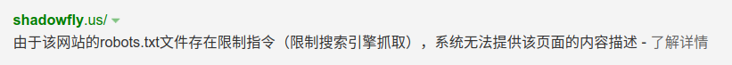
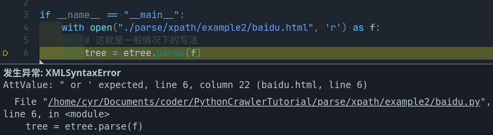
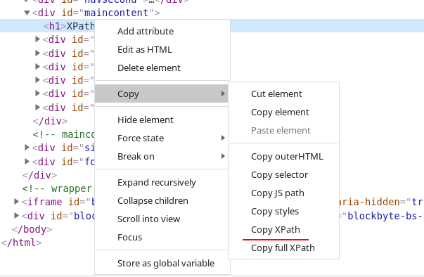

# [python crawler](https://github.com/AnDeltas/PythonCrawlerTutorial)

[toc]

> 编写一个Python 爬虫主要分为以下三步:
>
>   1. 请求数据
>
>   2. 数据解析
>
>   3. 数据持久化
>
> 我们从这三步入手, 开始学习Python爬虫

## 请求数据: requests库的使用

### [get与post](https://www.w3school.com.cn/tags/html_ref_httpmethods.asp)

```python
# 假如我们现在发送一个post请求
we_got_it = requests.post(url=url, headers=header, params=param, data=data)
# we_got_it 是什么数据由所 content-type 参数决定
# 这个参数包含在响应头中, 我们可以通过抓包工具查看

# 有些时候你得到的text中会含有乱码, 这是由于requests会猜测请求的数据的编码格式
# 但是有些时候会猜错, 这是候就需要你手动设定请求数据的编码格式, 防止乱码
we_got_it.encoding = "utf-8" # 这是候就会得到正确的文本

we_got_it.text # -> 返回str

we_got_it.content # -> 返回bytes, 在对一些图片之类的二进制数据进行请求的时候要用这个attr

we_got_it.json()
# 以上三种都是常用的属性或者函数, 可以自己查阅相关文档学习

# get只是比post少了一个data参数
```

你需要自己去了解一下post或者get里的这些参数都是干什么用的, 这都很简单, 我就不在这里赘述了.

### 反反爬

+ robots.txt 君子协定:smile:(所以说百度也是一个爬虫)

既然有爬虫, 网站就要有反爬的措施, 无论是UA验证还是各式各样的验证码都是为了反爬而存在的

+ user-agent: User Agent中文名为用户代理，简称 UA，它是一个特殊字符串头，使得服务器能够识别客户使用的[操作系统](https://baike.baidu.com/item/操作系统/192)及版本、CPU 类型、[浏览器](https://baike.baidu.com/item/浏览器/213911)及版本、浏览器渲染引擎、浏览器语言、[浏览器插件](https://baike.baidu.com/item/浏览器插件/8330255)等。

    我们一般需要在请求头中添加user-agent, 防止网站发现我们在使用爬虫访问网页

+ 验证码:现在有各种各样的验证码识别平台，我在这里拿斐斐打码举例，可以在官方文档中查看更详细的介绍：

```    python
m fateadm_api import Fatedmapi # 这个文件可以从官网下载
pd_id = ""  # 用户中心页可以查询到pd信息
key = ""
_id = ""  # 开发者分成用的账号，在开发者中心可以查询到
_key = ""
# 识别类型，
# 具体类型可以查看官方网站的价格页选择具体的类型，不清楚类型的，可以咨询客服
api = FateadmApi(app_id, app_key, pd_id, pd_key)

# 通过文件形式识别：
pred_type = "30400"

file_path = "checkimg.jpeg"
# 多网站类型时，需要增加src_url参数，具体请参考api文档: http://docs.fateadm.com/web/#/1?page_id=6
rsp = api.PredictFromFile(pred_type, file_name)  # 返回详细识别结果
print(rsp.pred_rsp.value) # 一般情况下验证码的值都会用在post的data参数中

just_flag = False
if just_flag:
    if rsp.ret_code == 0:
        # 识别的结果如果与预期不符，可以调用这个接口将预期不符的订单退款
        # 退款仅在正常识别出结果后，无法通过网站验证的情况，请勿非法或者滥用，否则可能进行封号处理
        api.Justice(rsp.request_id)
```

+ 还有其他很多反爬的措施, 都需要你一一去破解, 反爬的措施是一定能被破解的, 只要你伪装的足够像一个正常的用户

### cookie与session(会话跟踪技术)

#### cookie

> 打开京东网页, 不登录, 加入购物车, 关闭网页, 再次打开京东网页, 购物车内的东西还在, 这是什么原因呢? 换一台电脑或者用另一个浏览器,购物车内的东西还在吗?

如果你尝试了上述步骤, 就会明白, 有某些东西, 被存储在本地, 让你仍然能看到之前加入购物车内的商品.

HTTP是一种无状态协议[^1], cookie的存在就弥补了这种无状态协议的一种不足.

cookie由服务器生成, 由若干键值对构成, 存放在客户端, 只要cookie没有被清空或者已经失效(失效时间可以在浏览器中看到), 保存在cookie中的会话信息就是有效的. cookie会包含在第一次客户端请求的响应头中, 当下一次进行同类请求[^2]时, 就能使用上一次保留[^3]下来的cookie, 而不必由用户进行重复的操作了.这意味着cookie中可能会包含用户名密码这些敏感数据.

 不同的浏览器存放cookie的方式和地址都不同. 在chrome中, 可以通过 `设置 -> 网站设置 -> cookie`这个路径查看, 以后可能会有所改变, 但应该都差不多.

#### session

当访问服务器某个网页的时候，会在服务器端的内存里开辟一块内存，这块内存就叫做session，而这个内存是跟浏览器关联在一起的。这个浏览器指的是浏览器窗口，或者是浏览器的子窗口，意思就是，只允许当前这个session对应的浏览器访问，就算是在同一个机器上新启的浏览器也是无法访问的.

#### 用途

为什么要引入这两个概念呢? 假如说你要通过爬虫实现模拟登录, 而要登录的页面有验证码,你的代码就需要这样写:

```python
s = requests.session()
...
code_pic = s.get(...)
randcode_value = Predict(code_pic)
...
data = {
    ...
    "code": randcode_value,
    ...
}
html = s.post(url, data, ...)
```

这样才能实现模拟登陆, 如果不适用`requests.session()`, 在其他代码都正确的情况下, 每次都会得到一个答案: 验证码错误, 因为你相当于打开了一个新的网页, 之前获取的验证码的值已经失效了.

## 数据解析

### regex

+ [语法](parse/regex/正则表达式-语法.md)

+ [元字符](parse/regex/正则表达式-元字符.md)

+ [运算符优先级](parse/regex/正则表达式-运算符优先级.md)

+ [匹配规则](parse/regex/正则表达式-匹配规则.md)

### [bs4 BeatifulSoup](https://www.jianshu.com/p/9254bdc467b2)

> tips: 一般情况下, 还是用xpath比较好, 并且xpath支持的语言比较多

### XPath

+ 示例[parser.py](parse/xpath/example1/parser.py)

```python
from lxml import etree

if __name__ == "__main__":
    with open("xpath.html", 'r') as f:
        # 这就是一般情况下的写法
        tree = etree.HTML(f.read())
        path = "/html/body/div" #  <- 这里写我们的xpath表达式
        #  你可以尝试替换成其他的样子
        data = tree.xpath(path)
        print(data)
```

+ [xpath 语法](https://www.runoob.com/xpath/xpath-syntax.html)

+ 一些错误的处理[baidu.py](parse/xpath/example2/baidu.py)


```python
from lxml import etree

if __name__ == "__main__":
    with open("baidu.html", 'r') as f:
        parser = etree.HTMLParser(recover=f)
        # 出现这种情况是因为对应的html文件语法错误太多
        # 我们需要手动添加一个HTMLParser
        tree = etree.parse(f, parser=parser)
        path = "/html/body/div/@id"
        data = tree.xpath(path)
        print(data)
```

> tips: 通常状况下, xpath表达式可以在浏览器的抓包工具中通过复制得到

## 数据持久化

```python
with open("file", "w", encoding="utf-8") as f:
    f.write(data)
    # 暂时就粗糙的保存下来, 以后或许能做更多的工作
```

## 数据可视化

+ 这就是另一个故事了, 自己慢慢学吧.

> 好的, 学会上面这一些东西, 你就可以去做一些简单的爬虫工作了,  比如缺壁纸了可以找个免费的壁纸网站去爬上面的壁纸, 当然, 别爬太狠, 设置一下时间间隔

---

[^1]: 务器不知道客户端接下来会做什么, 甚至不知道会不会有下一次请求, 在这样的状况下, 一直保持tcp链接无异是一种很大的资源浪费.
[^2]: 资源路径相同的请求(不是url), 也有可能是由服务端设定好的路径.
[^3]: 保留的位置由服务器决定, 可能是浏览器的缓存, 也可能是硬盘, cookie的有效期也由也是由服务器决定的. 像有些网页登录时会有选项可以七天内登录不需要密码之类的, cookie的有效期就是七天.

> 声明:cookie与session部分引用了[Session原理](https://blog.csdn.net/weixin_42217767/article/details/92760353)
>
> 以上有些文件不能访问, 可以在最上面点开我的git仓库
